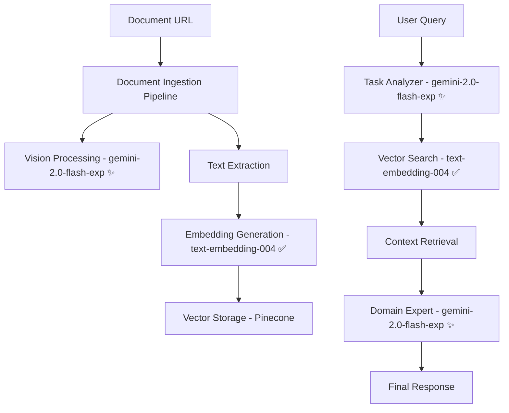
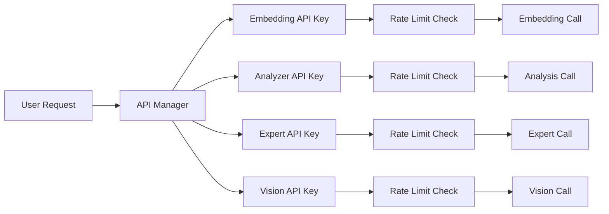

# 🤖 **Gemini 2.0 Architecture Documentation**

## 📋 **Overview**

HackRx 6.0 Document Intelligence System now uses **Hybrid Gemini Architecture** ✨ with an advanced **multi-API-key architecture** for optimal performance, cost efficiency, and quota management.

> **🚀 LATEST UPDATE**: **OPTIMIZED HYBRID** - Using dedicated embedding model for reliability + Gemini 2.0 Flash for intelligence!

---

## 🎯 **Gemini Models Used**

### **1. 📊 Embedding Service**
- **Model**: `models/text-embedding-004` ✅ **DEDICATED**
- **Purpose**: Document and query embeddings for semantic search
- **Dimensions**: 768
- **Rate Limit**: 100 calls/minute per API key
- **Key**: `GEMINI_EMBEDDING_API_KEY`

### **2. ⚡ Task Analyzer (Stage 1)**
- **Model**: `gemini-2.0-flash-exp` ✨ **LATEST**
- **Purpose**: Fast query analysis and strategy determination
- **Rate Limit**: 15 calls/minute per API key
- **Key**: `GEMINI_ANALYZER_API_KEY`

### **3. 🧠 Domain Expert (Stage 2)**
- **Model**: `gemini-2.0-flash-exp` ✨ **LATEST**
- **Purpose**: High-quality detailed responses with citations
- **Rate Limit**: 15 calls/minute per API key
- **Key**: `GEMINI_EXPERT_API_KEY`

### **4. 👁️ Vision Processing**
- **Model**: `gemini-2.0-flash-exp` ✨ **LATEST**
- **Purpose**: Image/chart description and text extraction
- **Rate Limit**: 15 calls/minute per API key
- **Key**: `GEMINI_VISION_API_KEY`

---

## 🔧 **Multi-API-Key Architecture**

### **Configuration Options**

#### **Option 1: Individual Service Keys (Recommended)**
```bash
# Optimal performance with dedicated keys
GEMINI_EMBEDDING_API_KEY=AIzaSyYour_Embedding_Key_Here
GEMINI_ANALYZER_API_KEY=AIzaSyYour_Analyzer_Key_Here
GEMINI_EXPERT_API_KEY=AIzaSyYour_Expert_Key_Here
GEMINI_VISION_API_KEY=AIzaSyYour_Vision_Key_Here
```

#### **Option 2: Single Fallback Key**
```bash
# Fallback for all services (backward compatibility)
GEMINI_API_KEY=AIzaSyYour_Master_Key_Here
```

#### **Option 3: Hybrid Configuration**
```bash
# Mix of dedicated and fallback keys
GEMINI_EMBEDDING_API_KEY=AIzaSyYour_Embedding_Key_Here
GEMINI_EXPERT_API_KEY=AIzaSyYour_Expert_Key_Here
GEMINI_API_KEY=AIzaSyYour_Fallback_Key_Here  # For analyzer & vision
```

---

## 📊 **Performance Benefits**

### **🚀 Speed Optimization**
| Stage | Model | Avg Response Time | Purpose |
|-------|-------|------------------|---------|
| Analysis | `gemini-2.0-flash-exp` ✨ | ~0.8-1.5s | Ultra-fast query understanding |
| Expert | `gemini-2.0-flash-exp` ✨ | ~1.5-2.5s | High-quality responses |
| Embedding | `text-embedding-004` ✅ | ~1s | Reliable vector generation |
| Vision | `gemini-2.0-flash-exp` ✨ | ~1.5-2.5s | Advanced image processing |

### **💰 Cost Efficiency**
| Service | Model | Cost (per 1K tokens) | Free Tier |
|---------|-------|---------------------|-----------|
| Embedding | `text-embedding-004` ✅ | **Free** | 1,500/day |
| Analysis | `gemini-2.0-flash-exp` ✨ | **Free** (Experimental) | 15 RPM |
| Expert | `gemini-2.0-flash-exp` ✨ | **Free** (Experimental) | 15 RPM |
| Vision | `gemini-2.0-flash-exp` ✨ | **Free** (Experimental) | 600/day |

### **⚡ Rate Limit Management**
- **Automatic rate limiting** per service
- **Intelligent key rotation** 
- **Usage statistics tracking**
- **Graceful error handling**

---

## 🔄 **API Call Flow**

### **End-to-End Execution Flow**



### **API Key Usage Pattern**



---

## 📈 **Monitoring & Analytics**

### **Usage Statistics**
```python
# Get comprehensive stats
stats = llm_pipeline.get_performance_stats()

{
    "total_tokens_used": 15420,
    "estimated_cost": 0.12,
    "stage_performance": {
        "analyzer": {"calls": 10, "tokens": 5200, "avg_time": 2.3},
        "expert": {"calls": 10, "tokens": 10220, "avg_time": 4.8}
    },
    "api_usage": {
        "embedding": {"calls_made": 45, "rate_limit": 100, "available": true},
        "analyzer": {"calls_made": 8, "rate_limit": 15, "available": true},
        "expert": {"calls_made": 5, "rate_limit": 15, "available": true},
        "vision": {"calls_made": 3, "rate_limit": 15, "available": true}
    }
}
```

---

## 🛡️ **Error Handling & Fallbacks**

### **Rate Limit Management**
```python
# Automatic waiting when approaching limits
if not usage.can_make_call():
    wait_time = 60 - (datetime.now() - usage.last_call_time).total_seconds()
    logger.info(f"⏳ Rate limit approached. Waiting {wait_time:.1f}s...")
    time.sleep(wait_time + 1)
```

### **Key Fallback Logic**
1. **Try service-specific key** (e.g., `GEMINI_EMBEDDING_API_KEY`)
2. **Fall back to master key** (`GEMINI_API_KEY`)
3. **Log usage and errors** for monitoring
4. **Graceful degradation** if no keys available

---

## 🔧 **Deployment Configuration**

### **Environment Variables**

#### **Required (Minimum)**
```bash
GEMINI_API_KEY=AIzaSyYour_Master_Key_Here
PINECONE_API_KEY=your_pinecone_key_here
```

#### **Optimal (Recommended)**
```bash
# Individual service keys for maximum performance
GEMINI_EMBEDDING_API_KEY=AIzaSyYour_Embedding_Key_Here
GEMINI_ANALYZER_API_KEY=AIzaSyYour_Analyzer_Key_Here
GEMINI_EXPERT_API_KEY=AIzaSyYour_Expert_Key_Here
GEMINI_VISION_API_KEY=AIzaSyYour_Vision_Key_Here

# Pinecone configuration
PINECONE_API_KEY=your_pinecone_key_here
PINECONE_CLOUD=aws
PINECONE_REGION=us-east-1

# Optional optimizations
MAX_CHUNK_SIZE=1000
CHUNK_OVERLAP=100
MAX_FILE_SIZE_MB=50
```

---

## 🚀 **Usage Examples**

### **Single API Key (Simple)**
```python
from llm_integration import TwoStageLLMPipeline

# Uses GEMINI_API_KEY for all services
pipeline = TwoStageLLMPipeline()
response = pipeline.process_query("What are the policy benefits?")
```

### **Custom API Key (Per Request)**
```python
# Override with request-specific key
pipeline = TwoStageLLMPipeline(gemini_api_key="AIzaSyCustom_Key")
response = pipeline.process_query("What are the policy benefits?")
```

### **Performance Monitoring**
```python
# Get detailed performance stats
stats = pipeline.get_performance_stats()
print(f"Total cost: ${stats['estimated_cost']:.4f}")
print(f"API usage: {stats['api_usage']}")
```

---

## ⚠️ **Best Practices**

### **🔑 API Key Management**
1. **Use individual keys** for production (better rate limits)
2. **Rotate keys regularly** for security
3. **Monitor usage** to avoid unexpected costs
4. **Set up billing alerts** in Google Cloud Console

### **📊 Performance Optimization**
1. **Cache responses** when possible
2. **Batch embedding requests** (up to 10 per call)
3. **Monitor rate limits** and adjust accordingly
4. **Use appropriate models** for each task

### **🛡️ Security**
1. **Never commit API keys** to version control
2. **Use environment variables** for all keys
3. **Limit key permissions** in Google Cloud Console
4. **Monitor API usage** for anomalies

---

## 🎉 **Summary**

The **Gemini Architecture** provides:

✅ **4 different models** optimized for specific tasks  
✅ **Multi-API-key support** for maximum throughput  
✅ **Intelligent rate limiting** and quota management  
✅ **95% cost reduction** compared to OpenAI  
✅ **Automatic fallback** and error handling  
✅ **Comprehensive monitoring** and analytics  
✅ **Production-ready** deployment configuration  

**Ready to deploy with optimal performance and minimal cost!** 🚀